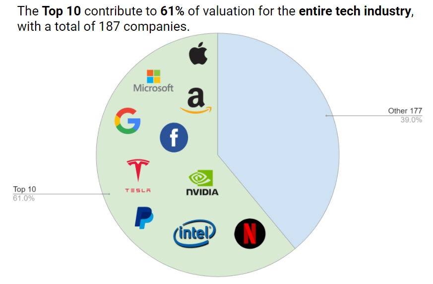
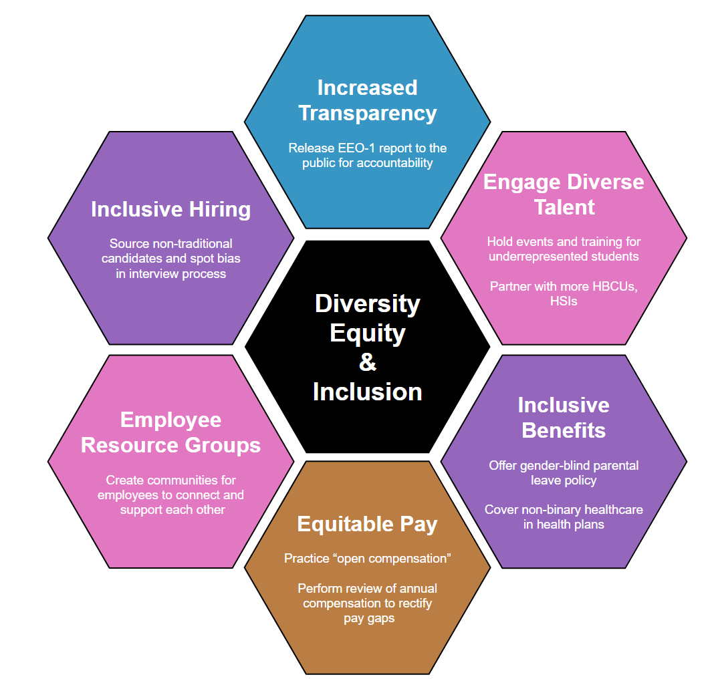

 Technology has a very wide reach and has become integrated  into everyday  life for the average American. But who are the people making key decisions that impact millions of people in the country? And do they represent the U.S. population that they serve? 

 Let’s explore how the tech industry has handled Diversity, Equity, and Inclusion, especially around gender and race. 
 

 

  <h3> Current state assessment of tech industry </h3>
  
An assessment of the tech industry today primarily relies upon self-reported data. From 2014 to 2018, representation of most minorities are below their percentages in the U.S. population.
  

 
Compare the demographics of different tech companies with the demographics of the U.S. Population. What do you notice? 
 

 
 We can see how  Females, Black, Latino, and Native American groups are disproportionately underrepresented at these tech companies compared to the U.S. population. 

  
<noscript></noscript><object class='tableauViz'  style='display:none;'><param name='host_url' value='https%3A%2F%2Fpublic.tableau.com%2F' /> <param name='embed_code_version' value='3' /> <param name='site_root' value='' /><param name='name' value='ComparisonofAllTechCompanies_16194980492360&#47;Dashboard1' /><param name='tabs' value='no' /><param name='toolbar' value='yes' /><param name='static_image' value='https:&#47;&#47;public.tableau.com&#47;static&#47;images&#47;Co&#47;ComparisonofAllTechCompanies_16194980492360&#47;Dashboard1&#47;1.png' /> <param name='animate_transition' value='yes' /><param name='display_static_image' value='yes' /><param name='display_spinner' value='yes' /><param name='display_overlay' value='yes' /><param name='display_count' value='yes' /><param name='language' value='en' /></object>
 
                

   

 <h3> Gender Diversity Breakdown </h3>
 
 In the previous vizualizations we see the gap between the genders does not significantly improve. Not many gains were made to include and retain women in the tech workforce. 

 Now, let’s look at the gender balance in top tech companies in 2018. The U.S. Population is very close to the 50:50 gender ratio. How many companies are close to this gender distribution? 

 
<noscript></noscript><object class='tableauViz'  style='display:none;'><param name='host_url' value='https%3A%2F%2Fpublic.tableau.com%2F' /> <param name='embed_code_version' value='3' /> <param name='site_root' value='' /><param name='name' value='GenderDiversityinTechCompanies_16198211195300&#47;Dashboard4' /><param name='tabs' value='no' /><param name='toolbar' value='yes' /><param name='static_image' value='https:&#47;&#47;public.tableau.com&#47;static&#47;images&#47;Ge&#47;GenderDiversityinTechCompanies_16198211195300&#47;Dashboard4&#47;1.png' /> <param name='animate_transition' value='yes' /><param name='display_static_image' value='yes' /><param name='display_spinner' value='yes' /><param name='display_overlay' value='yes' /><param name='display_count' value='yes' /><param name='language' value='en' /><param name='filter' value='publish=yes' /></object>
 
              

 

 
As you can see, only a few companies are close to the 50:50 gender ratio.

 <h3> Racial Diversity Breakdown </h3>
 
Moving on to racial diversity. This is self-reported data, the only data available to the public for most tech companies. Do any of them seem to be doing fairly well in terms of racial diversity? 
 

 
<noscript></noscript><object class='tableauViz'  style='display:none;'><param name='host_url' value='https%3A%2F%2Fpublic.tableau.com%2F' /> <param name='embed_code_version' value='3' /> <param name='site_root' value='' /><param name='name' value='DiversityinTechCompanies_16188954613140&#47;Dashboard2' /><param name='tabs' value='no' /><param name='toolbar' value='yes' /><param name='static_image' value='https:&#47;&#47;public.tableau.com&#47;static&#47;images&#47;Di&#47;DiversityinTechCompanies_16188954613140&#47;Dashboard2&#47;1.png' /> <param name='animate_transition' value='yes' /><param name='display_static_image' value='yes' /><param name='display_spinner' value='yes' /><param name='display_overlay' value='yes' /><param name='display_count' value='yes' /><param name='language' value='en' /><param name='filter' value='publish=yes' /></object>
 
  

 

 
 From the above visualization, Amazon appears to be doing  well in racial diversity compared to the other companies. However, this is because Amazon includes data about their warehouse workers. This paints an incomplete picture since Black and Latino employees are still heavily underrepresented in their corporate offices. 

 

 <h3> Top 10 Tech Companies </h3>
 
 Now, let's narrow our focus to the top 10 tech companies (by market cap) in the US. These companies are highly sought after by jobseekers and are often trendsetters within the tech industry, often shaping expectations for Diversity, Equity and Inclusion. 

 

  

    <h4> Market Landscape </h4>
   
 The top 10 tech companies take up 61% of the technology market, with the other 177 tech companies taking up 39% of market share. 

   
 While they are market leaders and have sufficient resources to attract a diverse candidate pool, how well do these companies do in terms of racial and gender diversity?

  

   
 
    
   

 

 <h3> Gender vs Race Representation at Top 10 Companies </h3>

 Let’s look at these top 10 companies’ performance balancing racial and gender diversity. Because companies can pad their self-reported data, we used the most recent EEO-1 reports, a standardized form that all companies submit to the federal government, to extract corporate roles only. 
 

 
Amazon and Tesla have not released this data to the public. For that reason, they are not shown below.

 
<noscript></noscript><object class='tableauViz'  style='display:none;'><param name='host_url' value='https%3A%2F%2Fpublic.tableau.com%2F' /> <param name='embed_code_version' value='3' /> <param name='site_root' value='' /><param name='name' value='top10techcompanies_final&#47;Sheet1' /><param name='tabs' value='no' /><param name='toolbar' value='yes' /><param name='static_image' value='https:&#47;&#47;public.tableau.com&#47;static&#47;images&#47;to&#47;top10techcompanies_final&#47;Sheet1&#47;1.png' /> <param name='animate_transition' value='yes' /><param name='display_static_image' value='yes' /><param name='display_spinner' value='yes' /><param name='display_overlay' value='yes' /><param name='display_count' value='yes' /><param name='language' value='en' /><param name='filter' value='publish=yes' /></object>
              

 

 
 <h3> Netflix: A Case Study of the "Best Performing" Tech Company  </h3>
 
Superficially and looking at percentage breakdown alone, Netflix is doing the best for race and gender in total. Yet, as underrepresented individuals progress through their careers, fewer and fewer make it through the ranks of professional, manager, and executive roles. Thus, retention is just as important to consider as hiring. 

 

 

    <figure class="figure col-md-4">
      
      <figcaption class="figure-caption">Executive: An individual who holds supervisory authority in an organization. Ex. CEO, CFO, COO etc.</figcaption>
   </figure>
  <figure class="figure col-md-4">
      
      <figcaption class="figure-caption">Manager: An individual who is responsible for overseeing a department or group of employees. Ex. Group Engineering Manager, Design Manager etc</figcaption>
   </figure>
  <figure class="figure col-md-4">
      
      <figcaption class="figure-caption">Professional: individual contributor with no managerial tasks and focuses mainly on their projects and deliverables. eg. software engineer, UX Designer, Data Scientist</figcaption>
   </figure>
  

 

 Hover over the arcs to get more information about Netflix’s racial and gender breakdown across these roles. What do you notice? 

  <iframe width="100%" height="800px" frameborder="0"
    src="https://observablehq.com/embed/@priyankaad/sequences-sunburst-for-paypal?cells=breadcrumb%2Cviewof+sunburst"></iframe>

 

 <h3> Looking to the Future </h3>
 The story is ongoing and tech companies are far from reaching parity. In showing the projections based on these companies’ progress from 2014 to 2018, we focused on the gender parity story only as gender proportions stay fairly stable around 50%. Meanwhile, with minority representation in the US projected to continue increasing, this percentage is an ever moving target and pose a more complicated dilemma for tech companies to address. 

 <h3>  Projected Timeline for Gender Parity at Top 10 Companies </h3>
 
From the timeline, Netflix is the only top 10 tech company projected to reach gender parity this year. The others will reach gender parity many years later, with Nvidia projected at 2150. 

 
<noscript></noscript><object class='tableauViz'  style='display:none;'><param name='host_url' value='https%3A%2F%2Fpublic.tableau.com%2F' /> <param name='embed_code_version' value='3' /> <param name='site_root' value='' /><param name='name' value='Top10_Timelines&#47;Dashboard1' /><param name='tabs' value='no' /><param name='toolbar' value='yes' /><param name='static_image' value='https:&#47;&#47;public.tableau.com&#47;static&#47;images&#47;To&#47;Top10_Timelines&#47;Dashboard1&#47;1.png' /> <param name='animate_transition' value='yes' /><param name='display_static_image' value='yes' /><param name='display_spinner' value='yes' /><param name='display_overlay' value='yes' /><param name='display_count' value='yes' /><param name='language' value='en' /></object>

                

 

 
 <h3> Recommendations </h3>
 
The timeline above paints a dire picture; however  it is still merely a prediction. With the right interventions and practices, perhaps these tech companies can significantly improve hiring and retention of  underrepresented groups. 

 
Here are some DE&I efforts taken by  Netflix which have significantly helped them hire and retain a diverse workforce consequently  creating an inclusive workplace.  

 

 
 

 

 
 

 <h4> Transparency </h4> 
  
 Requiring companies to release their EEO-1 reports to the public will allow all to be judged on the same standardized scale. In this manner, companies cannot self-report their data which inflate diversity. 

 

 
 

 <h4>Accountability </h4> 
 
Hiring is only one aspect of the problem. Issues arise in retention as well, especially as individuals progress in their careers from professionals to managers. As such, huge pay gaps occur as individuals of specific groups advance on the career ladder and others do not. Publically releasing race and gender breakdown of pay scale as Intel has done (the only tech company to do so) allows the public to hold them accountable for their DEI efforts to retain and support all of their employees. 

 

 

<!-- Visit https://codepen.io/nicolaskadis/full/brQEOd/ for the latest, no js version! -->

  

    

      

        

          <!-- To add FontAwesome Icons use Unicode characters and to set size use font-size instead of fa-*x because when calculating the height (see js), the size of the icon is not calculated if using classes -->
          &#xf118;
          <h6 class="card-title">Push for Corporate Transparency</h6>
        

        

          

           Encourage your employer and leadership to release the EEO-1 reports to the public. This is the first step in holding your employers accountable and creating transparency. 

        

      

    

    

      

        

          &#xf118;
          <h6 class="card-title"> Be a Diversity Advocate </h6>
        

        

          
 Educate yourself and speak up when you see unfairness or bias based on gender, race, sexual orientation etc. 

        

      

    

    

      

        

<!--            -->
<!--           &#xf118; -->
          <h6 class="card-text">Donate</h6>
        

        

          
 Support and donate to NGOs such as GirlsWhoCode, BlackGirlsCode, Code2040 

        

      

    

  

<!-- NO JS VERSION: https://codepen.io/nicolaskadis/full/brQEOd/ -->

