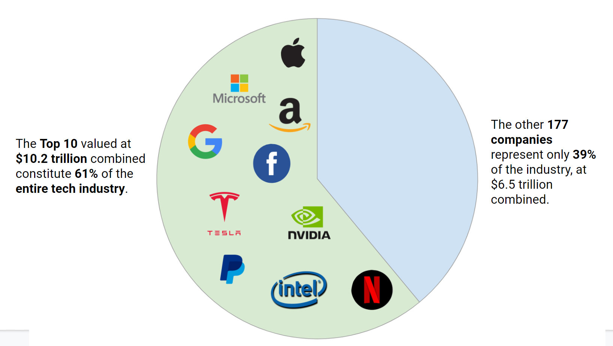

 Technology has a very wide reach and has become integrated  into everyday  life for the average American. But who are the people making key decisions that impact millions of people in the country? And do they represent the U.S. population that they serve? 

 Let’s explore how the tech industry has handled Diversity, Equity, and Inclusion, especially around gender and race. 
 

 

  <h3> Current State Assessment of Tech Industry </h3>
  
An assessment of the tech industry today primarily relies upon self-reported data. From 2014 to 2018, representation of most minorities are below their percentages in the U.S. population.
  

 
Hover over different tech companies to compare their demographics with the demographics of the U.S. Population. What do you notice? 
 

 
 We can see how  Females, Black, Latino, and Native American groups are disproportionately underrepresented at these tech companies compared to the U.S. population. 

 
<noscript></noscript><object class='tableauViz'  style='display:none;'><param name='host_url' value='https%3A%2F%2Fpublic.tableau.com%2F' /> <param name='embed_code_version' value='3' /> <param name='site_root' value='' /><param name='name' value='ComparisonofAllTechCompanies&#47;Dashboard12' /><param name='tabs' value='no' /><param name='toolbar' value='yes' /><param name='static_image' value='https:&#47;&#47;public.tableau.com&#47;static&#47;images&#47;Co&#47;ComparisonofAllTechCompanies&#47;Dashboard12&#47;1.png' /> <param name='animate_transition' value='yes' /><param name='display_static_image' value='yes' /><param name='display_spinner' value='yes' /><param name='display_overlay' value='yes' /><param name='display_count' value='yes' /><param name='language' value='en' /><param name='filter' value='publish=yes' /></object>
                
 

 <h3> Gender Diversity Breakdown </h3>
 
 In the previous vizualizations we see the gap between the genders does not significantly improve. Not many gains were made to include and retain women in the tech workforce. 

 Now, let’s look at the gender balance in top tech companies in 2018. The U.S. Population is very close to the 50:50 gender ratio. How many companies are close to this gender distribution? 

 
<noscript></noscript><object class='tableauViz'  style='display:none;'><param name='host_url' value='https%3A%2F%2Fpublic.tableau.com%2F' /> <param name='embed_code_version' value='3' /> <param name='site_root' value='' /><param name='name' value='GenderDiversityinTechCompanies_16198211195300&#47;Dashboard4' /><param name='tabs' value='no' /><param name='toolbar' value='yes' /><param name='static_image' value='https:&#47;&#47;public.tableau.com&#47;static&#47;images&#47;Ge&#47;GenderDiversityinTechCompanies_16198211195300&#47;Dashboard4&#47;1.png' /> <param name='animate_transition' value='yes' /><param name='display_static_image' value='yes' /><param name='display_spinner' value='yes' /><param name='display_overlay' value='yes' /><param name='display_count' value='yes' /><param name='language' value='en' /><param name='filter' value='publish=yes' /></object>
 
              

 

 
As you can see, only a few companies are close to the 50:50 gender ratio.

 <h3> Racial Diversity Breakdown </h3>
 
Moving on to racial diversity. This is self-reported data, the only data available to the public for most tech companies. The US population is the benchmark for racial diversity. Which of these companies best represent the US population in racial diversity?
 

 
<noscript></noscript><object class='tableauViz'  style='display:none;'><param name='host_url' value='https%3A%2F%2Fpublic.tableau.com%2F' /> <param name='embed_code_version' value='3' /> <param name='site_root' value='' /><param name='name' value='DiversityinTechCompanies_16188954613140&#47;RacialDiversityFlowerpetals' /><param name='tabs' value='no' /><param name='toolbar' value='yes' /><param name='static_image' value='https:&#47;&#47;public.tableau.com&#47;static&#47;images&#47;Di&#47;DiversityinTechCompanies_16188954613140&#47;RacialDiversityFlowerpetals&#47;1.png' /> <param name='animate_transition' value='yes' /><param name='display_static_image' value='yes' /><param name='display_spinner' value='yes' /><param name='display_overlay' value='yes' /><param name='display_count' value='yes' /><param name='language' value='en' /><param name='filter' value='publish=yes' /></object>
 
                
 

 
 From the above visualization, Amazon appears to be doing  well in racial diversity compared to the other companies. However, this is because Amazon includes data about their warehouse workers. This paints an incomplete picture since Black and Latino employees are still heavily underrepresented in their corporate offices. 

 

 <h3> Top 10 Tech Companies </h3>
 
 Now, let's narrow our focus to the top 10 tech companies (by market cap) in the US. These companies are highly sought after by jobseekers and are often trendsetters within the tech industry, often shaping expectations for Diversity, Equity and Inclusion. 

 

  

    <h5> Market Landscape </h5>
    
 While they are market leaders and have sufficient resources to attract a diverse candidate pool, how well do these companies do in terms of racial and gender diversity?

  

   
 
    
   

 

 <h3> Gender vs Race Representation at Top 10 Companies </h3>

 Let’s look at these top 10 companies’ performance balancing racial and gender diversity. Because companies can pad their self-reported data, we used the most recent EEO-1 reports, a standardized form that all companies submit to the federal government, to extract corporate roles only. 
 

 
<b>Amazon</b> and <b>Tesla</b> have not released this data to the public. For that reason, they are not shown below.

 
<noscript></noscript><object class='tableauViz'  style='display:none;'><param name='host_url' value='https%3A%2F%2Fpublic.tableau.com%2F' /> <param name='embed_code_version' value='3' /> <param name='site_root' value='' /><param name='name' value='top10techcompanies_final&#47;Sheet1' /><param name='tabs' value='no' /><param name='toolbar' value='yes' /><param name='static_image' value='https:&#47;&#47;public.tableau.com&#47;static&#47;images&#47;to&#47;top10techcompanies_final&#47;Sheet1&#47;1.png' /> <param name='animate_transition' value='yes' /><param name='display_static_image' value='yes' /><param name='display_spinner' value='yes' /><param name='display_overlay' value='yes' /><param name='display_count' value='yes' /><param name='language' value='en' /><param name='filter' value='publish=yes' /></object>
              

 

 
Based on the scatterplot, it looks like Netflix is the closest to the 50/50 “target” for both race and gender diversity. Does this diversity still hold true the higher one climbs up the corporate ladder? 

 
 <h3> Netflix: A Case Study of the "Best Performing" Tech Company  </h3>
 
Let’s dig deeper into the gender and racial distribution across Executive, Manager and Professional roles  at Netflix.

 
Superficially and looking at percentage breakdown alone, Netflix is doing the best for race and gender in total. Yet, as underrepresented individuals progress through their careers, fewer and fewer make it through the ranks. Thus, retention is just as important to consider as hiring. 

 

 

    <figure class="figure col-md-4">
      
      <figcaption class="figure-caption">Executive: An individual who holds supervisory authority in an organization eg. CEO, CFO, COO etc.</figcaption>
   </figure>
  <figure class="figure col-md-4">
      
      <figcaption class="figure-caption">Manager: Responsible for overseeing a department eg. Group Engineering Manager etc</figcaption>
   </figure>
  <figure class="figure col-md-4">
      
      <figcaption class="figure-caption">Professional: Individual contributor with no managerial tasks eg. software engineer, UX Designer</figcaption>
   </figure>
  

 

 <h5>Diversity Across Different Roles at Netflix</h5>
 
Hover over the arcs to get more information about Netflix’s racial and gender breakdown across these roles. What do you notice? 

  <iframe width="100%" height="800px" frameborder="0"
    src="https://observablehq.com/embed/@priyankaad/sequences-sunburst-for-paypal?cells=breadcrumb%2Cviewof+sunburst"></iframe>

 
 From aggregate numbers, Netflix seems to have a diverse racial and gender representation. Yet, as underrepresented individuals progress through their careers, fewer and fewer make it through the ranks of manager and executive roles. Thus, retention is just as important to consider as hiring. 

 

 <h3> Looking to the Future </h3>
 
Everything we’ve seen so far is based on data from 2014 - 2018. What does this mean for the future of tech? Will the top 10 tech companies ever reach gender parity? How long will that take? Let’s look down below.

 

<noscript></noscript><object class='tableauViz'  style='display:none;'><param name='host_url' value='https%3A%2F%2Fpublic.tableau.com%2F' /> <param name='embed_code_version' value='3' /> <param name='site_root' value='' /><param name='name' value='Timelines_Updated&#47;Sheet1' /><param name='tabs' value='no' /><param name='toolbar' value='yes' /><param name='static_image' value='https:&#47;&#47;public.tableau.com&#47;static&#47;images&#47;Ti&#47;Timelines_Updated&#47;Sheet1&#47;1.png' /> <param name='animate_transition' value='yes' /><param name='display_static_image' value='yes' /><param name='display_spinner' value='yes' /><param name='display_overlay' value='yes' /><param name='display_count' value='yes' /><param name='language' value='en' /><param name='filter' value='publish=yes' /></object>

 
From the timeline, Netflix is the only top 10 tech company projected to reach gender parity this year. The others will reach gender parity many years later, with Nvidia projected at 2150. <b>Amazon</b> and <b>Tesla</b> were not included because they do not release data. <b>Paypal</b> and <b>Microsoft</b> actually have had negative progress so they would not reach parity...ever. 

 
 <h3> Recommendations </h3>
 
The timeline above paints a dire picture; however  it is still merely a prediction. With the right interventions and practices, perhaps these tech companies can significantly improve hiring and retention of  underrepresented groups. 

 
Here are some DE&I efforts taken by  Netflix which have significantly helped them hire and retain a diverse workforce consequently  creating an inclusive workplace. 

 

 
 

   

     
 

 

 <h3>What You Can Do to Make a Change </h3>

We believe all of us have a role to play in making the tech industry a more inclusive place for all. Uncover how  you can help make a positive change in the tech industry.

<!-- Visit https://codepen.io/nicolaskadis/full/brQEOd/ for the latest, no js version! -->

  

    

      

        

          <!-- To add FontAwesome Icons use Unicode characters and to set size use font-size instead of fa-*x because when calculating the height (see js), the size of the icon is not calculated if using classes -->
<!--           &#xf118; -->
         
          <h6 class="card-title">Push for Corporate Transparency</h6>
        

        

          
 Encourage your employer and leadership to release the EEO-1 reports to the public. This is the first step in holding your employers accountable and creating transparency. 

        

      

    

    

      

        

<!--           &#xf118; -->
         
          <h6 class="card-title"> Be a Diversity Advocate </h6>
        

        

          
 Educate yourself and speak up when you see unfairness or bias based on gender, race, sexual orientation etc. 

        

      

    

    

      

        

          
<!--           &#xf118; -->
          <h6 class="card-title">Donate</h6>
        

        

          
 Support and donate to NGOs such as GirlsWhoCode, BlackGirlsCode, Code2040 

    

  

<!-- NO JS VERSION: https://codepen.io/nicolaskadis/full/brQEOd/ -->

